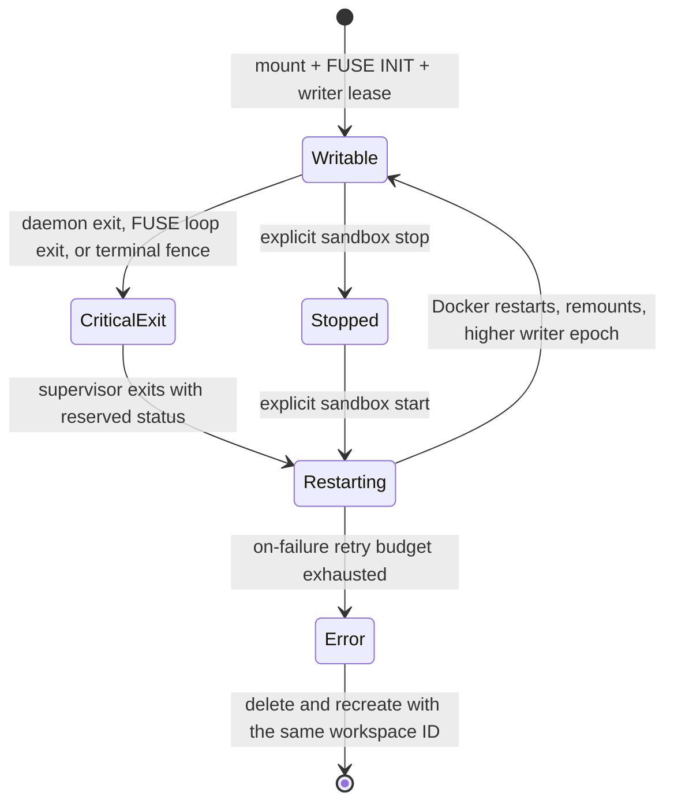
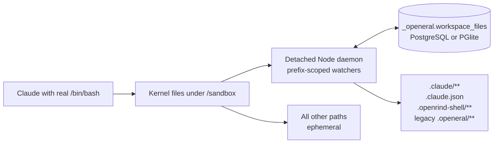
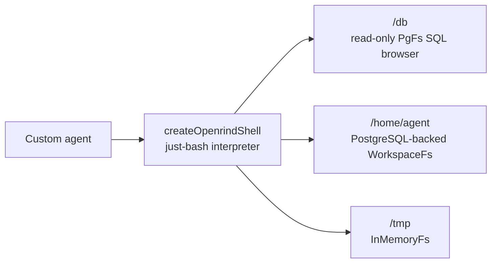

# Architecture

## Runtime Split

Openrind Shell has two intentionally separate sandbox runtimes:

- The primary image uses an OpenShell-supervised FUSE mount backed by external
  PostgreSQL for `/sandbox/work`, plus a per-workspace Docker named volume for
  Claude's high-churn home at `/sandbox/claude-home`. Neither path uses a file watcher.
- The compatibility image uses the existing real filesystem plus prefix-scoped
  replication. It supports optional PostgreSQL and PGlite and persists only Claude
  and Openrind Shell state.

The just-bash `WorkspaceFs`/`PgFs` library path remains available to custom agents. It
is not the filesystem used by Claude Code in either sandbox image.

## Primary Sandbox Lifecycle

OpenShell replaces the image entrypoint with `openshell-sandbox`. The trailing command
after `sandbox create --` is executed over SSH after Ready; it never becomes PID 1.

```mermaid
flowchart TB
  create["sandbox create --fuse<br/>--upload db-url -- openrind-shell-init"]
  gate["Docker driver validates request<br/>enable_fuse=true and /dev/fuse"]

  subgraph container["Sandbox container startup"]
    supervisor["openshell-sandbox PID 1"]
    validate["Validate immutable fuse_mounts policy,<br/>root-owned daemon, normalized empty mountpoint"]
    mount["Open /dev/fuse and mount /sandbox/work"]
    prelude["Install TSYNC supervisor prelude<br/>mount and unmount now denied"]
    daemon["Spawn openrind-shell-fused as sandbox:sandbox<br/>through ProcessHandle"]
    fds["Inherited FD 0: FUSE channel<br/>Inherited FD 1: readiness pipe"]
    ready["FUSE INIT complete"]
    services["Start SSH and managed<br/>sleep infinity workload"]
  end

  subgraph trailing["Post-Ready trailing command over SSH"]
    upload["Upload /sandbox/db-url"]
    init["openrind-shell-init one-shot"]
    database["Migrate V1-V8, bridge renamed rows,<br/>prepare volume and one-time legacy import"]
    verify["Verify writer lease in PostgreSQL<br/>and fsync/read/unlink through mount"]
    configure["Prepare user-owned Claude home,<br/>configure Openrind Gateway, remove upload"]
    marker["Write init marker and exit 0"]
  end

  create --> gate --> supervisor --> validate --> mount --> prelude --> daemon
  daemon --> fds --> ready --> services
  services -->|"OpenShell reports Ready"| upload --> init
  init --> database --> verify --> configure --> marker
```

The FUSE daemon starts before the database upload exists. It completes the kernel
FUSE handshake, keeps the mount present, and returns bounded `EIO` for operations that
cannot wait for database readiness. The init-owned marker and management socket are
same-UID coordination mechanisms, not security trust signals. Initialization also
checks the lease row and mounted durability independently.

## Data Path

```mermaid
flowchart LR
  tools["Claude, git, compilers,<br/>editors, language servers"]
  vfs["Linux VFS<br/>/sandbox/work"]
  kernel["Kernel FUSE channel<br/>supervisor-owned FD"]
  daemon["openrind-shell-fused<br/>sandbox UID + Landlock + seccomp"]
  proxy["OpenShell local proxy<br/>binary-attributed endpoint policy"]
  tls["Raw CONNECT tunnel<br/>PostgreSQL TLS end to end"]
  schema[("PostgreSQL<br/>_openeral.fs_* namespace")]

  tools -->|"POSIX syscalls"| vfs --> kernel --> daemon
  daemon -->|"HTTP CONNECT only<br/>no direct-dial fallback"| proxy --> tls --> schema
```

Claude receives neither `/dev/fuse` nor mount capability. The Rust daemon refuses to
dial PostgreSQL directly: a valid OpenShell HTTP proxy environment is mandatory. The
PostgreSQL endpoint uses `tls: skip` at the OpenShell route so the proxy relays the
non-HTTP PostgreSQL TLS session without terminating it.

The default interactive cwd is `/sandbox/work`, while the sandbox user's login home
stays `/sandbox`. Initialization installs a hook in `/sandbox/.bashrc` that enters the
FUSE mount. The `claude` wrapper alone sets `HOME=/sandbox/claude-home`, a persistent
per-workspace Docker named volume, so Claude's high-churn settings and session state do
not add remote filesystem latency to terminal startup and input. Project discovery still
targets `/sandbox/work`; the FUSE daemon therefore keeps a generation-fenced metadata
and directory cache. Its first lookup loads one authoritative directory snapshot, and
subsequent hits and misses stay local until a committed namespace mutation invalidates
the cache.
`/sandbox` remains the OCI bootstrap working directory because initialization and
supervisor startup must work before the database-backed mount is writable.

## Storage Model

Migration V7 introduces a normalized namespace:

- `fs_volumes`: workspace-to-volume identity and root inode.
- `fs_nodes`: stable inode metadata, type, mode, ownership, timestamps, size, links,
  generation, symlink target, and deletion state.
- `fs_dirents`: byte-preserving parent/name/child namespace edges.
- `fs_chunks`: sparse 256 KiB file chunks.
- `fs_mount_epochs`: one-writer lease, owner, expiry, and fencing epoch.
- `fs_operations`: mutation IDs and request hashes for uncertain-commit resolution.
- `fs_legacy_imports`: one-time import completion from scoped-sync rows.

TypeScript owns migrations, volume preparation, and legacy import. Rust validates the
installed schema and never migrates it. A PostgreSQL advisory lock and expiring lease
allow only one writable daemon for a workspace.

Migration V8 is an upgrade bridge for compatibility images from the renamed just-bash
branch. If `_openrind.workspace_config` and `_openrind.workspace_files` exist, their
rows are copied into `_openeral` once; conflicts keep the row with the newer mtime.
It records source-workspace provenance so first-time volume preparation imports every
valid just-bash home path. Older `_openeral` compatibility workspaces still import
only the historical state allowlist. The normalized FUSE tables never move out of
`_openeral`.

## Durability Contract

Ordinary writes enter a shared, bounded dirty cache and are flushed in the background.
They are not all synchronous PostgreSQL commits.

The following are durability barriers:

- `fsync` and `fdatasync`;
- `O_SYNC` and `O_DSYNC` writes;
- dirty-source rename, including replacement, which commits captured data and the
  namespace transaction before success;
- close/FLUSH after rewriting a pre-existing file through `O_TRUNC`;
- the Claude wrapper's final `openrind-shell-fused flush-all` on clean exit.

Namespace and metadata mutations commit synchronously. Uncertain mutation commits are
resolved through operation IDs. A lost PostgreSQL connection is not a lost lease: the
daemon reconnects within the lease safety window, re-takes the advisory lock, and
renews the same owner/epoch before serving again; mutations return `EIO` meanwhile.
On terminal lease loss (the row was taken over or expired), the old daemon discards
dirty bytes, surfaces writeback errors, never reacquires a new epoch in-process, and
exits.

## Failure And Recovery

In-process remount is intentionally impossible after the supervisor installs its
TSYNC seccomp prelude. Recovery therefore rebuilds the container mount namespace:

Explicit sandbox stop remains Stopped; explicit start reconstructs the mount. A
sandbox that exhausted the retry budget is terminal `Error`; `sandbox start` requires
`Stopped`, so recovery is delete plus recreate with the same workspace ID. An arbitrary
alive-but-deadlocked daemon is a documented v1 gap because same-UID health endpoints
cannot serve as a supervisor trust signal.

A container restart terminates every process in the sandbox, including interactive
SSH shells and Claude sessions. Open file descriptors and unbarriered dirty bytes
cannot survive it. Committed data survives daemon, container, and sandbox
replacement.

## Security Boundary

The FUSE capability is default-off in three places: the public request, the image's
immutable policy, and Docker's operator config. Unsupported drivers reject it.

The supervisor validates the daemon binary and mountpoint, performs the privileged
mount, then launches the daemon through the normal unprivileged child path. The daemon
inherits the sandbox UID, Landlock, child seccomp, network namespace, proxy, TLS roots,
and binary-attributed egress policy. Claude cannot choose the daemon, mountpoint, or
inherited descriptors.

V1 does not claim same-UID secret isolation. Claude and the daemon share the sandbox
UID; Claude can read runtime files and signal the daemon. Network policy, TLS, lease
fencing, and least-privilege PostgreSQL roles remain required. A separate storage UID
and supervisor-mediated secret channel are future hardening work.

Provider keys are different from the uploaded PostgreSQL URL. OpenShell injects
provider placeholders and resolves them only in approved HTTPS routes. Openrind
Gateway presign creation is constrained to `POST /v1/presign` with request-body
credential rewriting. Raw PostgreSQL cannot use that placeholder mechanism, so its
URL is a mode-0600 upload consumed into runtime state and removed from `/sandbox`
after init. Legacy StringCost routes remain temporarily for existing providers.

## Compatibility Runtime

`Dockerfile.openrind-shell-compat` retains the previous model:

It supports PGlite and optional PostgreSQL. Source files outside those prefixes are
ephemeral. The Docker-only tests under `tests/test_sandbox_e2e.sh` and
`tests/test_setup_e2e.sh` target this image explicitly.

## Custom-Agent Library Path

`createOpenrindShell()` remains an in-process just-bash integration. The legacy
`createOpeneralShell()` export is an alias:

This path is useful when every command is interpreted by just-bash. Native Claude Code
uses the kernel-backed sandbox paths above and does not see `/db` as a virtual mount.
