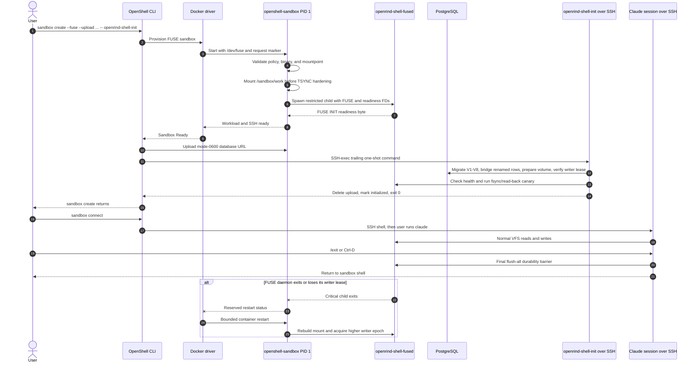
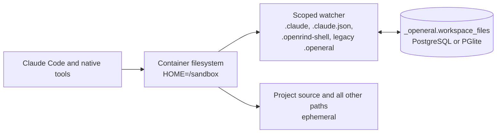

# Openrind Shell

Run Claude Code in an isolated OpenShell sandbox with a PostgreSQL-backed native
project filesystem. In the primary runtime, project files live on the FUSE mount at
`/sandbox/work`, while Claude's high-churn home state lives on a per-workspace Docker
volume at `/sandbox/claude-home`. OpenShell owns both mounts and keeps PostgreSQL
traffic behind its default-deny network policy.

## Runtime Status

| Runtime | Persistence | OpenShell requirement | Status |
|---|---|---|---|
| Primary FUSE image (`Dockerfile.openrind-shell`) | Project files in PostgreSQL FUSE; Claude state in a local named volume | Vendored Docker-driver build with `--fuse` and driver-config named-volume mounts | Implemented; source build and `:fuse` publication target |
| Compatibility image (`Dockerfile.openrind-shell-compat`) | `.claude`, `.claude.json`, `.openrind-shell`, and legacy `.openeral` | Stock current OpenShell | GHCR `:just-bash` target; registry pull access currently required |

The FUSE capability is a default-off OpenShell patch pinned under
[`vendor/openshell`](./vendor/openshell). It is not in a released upstream OpenShell
version yet. Do not present the `:just-bash` publication target as the FUSE runtime.

The primary image inherits NVIDIA's published Community base directly. Openrind Shell does
not rebuild that base image.

The source tree and PostgreSQL schema retain some `openeral` names for upgrade
compatibility. In particular, `_openeral` is the stable on-disk database namespace;
renaming public commands does not abandon existing workspaces. Migration V8 also
imports newer compatibility rows from the short-lived `_openrind.workspace_*`
namespace without overwriting rows whose `_openeral` mtime is newer. When that
workspace creates its first FUSE volume, all valid just-bash home paths are imported;
older scoped `_openeral` workspaces retain their narrower state-only import.

## Architecture At A Glance

The primary runtime keeps the privileged mount operation in OpenShell while the
filesystem implementation runs as an ordinary sandbox child. Claude reaches
PostgreSQL only through kernel filesystem calls; it does not receive `/dev/fuse`, a
mount capability, or a direct database network path.

```mermaid
flowchart LR
  subgraph control["Host and OpenShell control plane"]
    user["User"]
    cli["Patched OpenShell CLI<br/>sandbox create --fuse"]
    gateway["OpenShell gateway<br/>policy and provider control"]
    driver["Docker driver<br/>enable_fuse operator gate"]
  end

  subgraph sandbox["OpenShell sandbox container"]
    supervisor["openshell-sandbox<br/>PID 1"]
    workload["Managed workload<br/>sleep infinity"]
    ssh["SSH sessions<br/>init, shell, Claude"]
    claude["Claude Code<br/>HOME=/sandbox/claude-home<br/>cwd=/sandbox/work"]
    vfs["Linux VFS<br/>/sandbox/work"]
    claudehome["Docker named volume<br/>/sandbox/claude-home"]
    fused["openrind-shell-fused<br/>critical sandbox child"]
    runtime["/var/lib/openrind-shell/runtime<br/>same-UID coordination"]
    proxy["OpenShell egress proxy<br/>binary-attributed policy"]
  end

  postgres[("External PostgreSQL<br/>normalized _openeral.fs_* tables")]

  user --> cli --> gateway --> driver --> supervisor
  supervisor --> workload
  supervisor --> ssh
  ssh --> claude
  claude -->|"project I/O"| vfs
  claude -->|"settings, sessions, cache"| claudehome
  supervisor -->|"open /dev/fuse, mount, pass FDs"| fused
  vfs -->|"FUSE requests"| fused
  fused <-->|"health socket, DB readiness, init marker"| runtime
  fused -->|"HTTP CONNECT"| proxy
  proxy -->|"raw tunnel, end-to-end PostgreSQL TLS"| postgres
```



The supervisor mounts before applying its TSYNC mount-denying seccomp prelude, then
starts `openrind-shell-fused` through the normal unprivileged `ProcessHandle` path. The
daemon inherits Landlock, child seccomp, the network namespace, proxy variables, TLS
roots, and two supervisor-selected descriptors: the FUSE channel and a readiness
channel. The compatibility image does not use this path.

## Primary FUSE Runtime

### Prerequisites

- Linux with Docker and `/dev/fuse`.
- The vendored OpenShell CLI, gateway, and supervisor built from this repository.
- Docker driver configuration with `enable_fuse = true`.
- An external PostgreSQL URL. PGlite is intentionally unsupported in this image.
- A configured Claude provider, such as `claude` or `aws`.

Build instructions for the patched OpenShell components are in [BUILD.md](./BUILD.md).

### Build The Openrind Shell Image

```bash
docker pull ghcr.io/nvidia/openshell-community/sandboxes/base:latest
docker build --pull=false -f Dockerfile.openrind-shell -t openrind-shell-fuse:local .
```

This builds only the Openrind Shell child image and its Rust daemon. It reuses the published
NVIDIA base.

### Create And Initialize

Point the patched CLI at the patched Docker gateway:

```bash
export OPENSHELL_BIN="$PWD/vendor/openshell/target/debug/openshell"
export OPENSHELL_GATEWAY_ENDPOINT="http://127.0.0.1:18770"
export OPENRIND_SHELL_WORKSPACE_ID="${OPENRIND_SHELL_WORKSPACE_ID:-openrind-shell-demo}"
export DATABASE_URL="${DATABASE_URL:-${POSTGRES_URL:-}}"
```

Create a temporary database upload and initialize the sandbox:

```bash
db_file="$(mktemp /tmp/openrind-shell-db-url-XXXXXX)"
trap 'rm -f "$db_file"' EXIT
printf '%s' "$DATABASE_URL" > "$db_file"
chmod 600 "$db_file"

"$OPENSHELL_BIN" \
  --gateway-endpoint "$OPENSHELL_GATEWAY_ENDPOINT" \
  sandbox create \
  --name "$OPENRIND_SHELL_WORKSPACE_ID" \
  --from openrind-shell-fuse:local \
  --fuse \
  --upload "$db_file:/sandbox/db-url" \
  --provider claude \
  --auto-providers \
  --env "OPENRIND_SHELL_WORKSPACE_ID=$OPENRIND_SHELL_WORKSPACE_ID" \
  --no-tty \
  -- openrind-shell-init

rm -f "$db_file"
trap - EXIT
```

`openrind-shell-init` runs after OpenShell reports the sandbox Ready. It is a one-shot SSH
command that migrates PostgreSQL, prepares the normalized volume, verifies the writer
lease, performs an fsync/read-back canary through the mounted filesystem, configures
Claude, removes the uploaded URL, and exits.

Check the create command's exit status: a sandbox whose initialization failed still
lists as `Ready`, because the supervisor and mount are up but the volume is not. When
in doubt, verify before use:

```bash
"$OPENSHELL_BIN" --gateway-endpoint "$OPENSHELL_GATEWAY_ENDPOINT" \
  sandbox exec -n "$OPENRIND_SHELL_WORKSPACE_ID" -- openrind-shell-fused health
```

The reported `state` must be `writable`.



OpenShell's trailing command is deliberately not a service: it is delivered over SSH
after Ready and exits. The supervisor-owned FUSE daemon is the long-lived critical
service and survives ordinary SSH disconnects and repeated Claude sessions.

For Supabase, use an IPv4-compatible **session-mode** pooler URL on port 5432. Port
6543 is transaction pooling, which detaches sessions from backends and would break the
one-writer lease; `openrind-shell-init` rejects it. The included policy covers
`*.pooler.supabase.com`; other database hosts need an exact policy entry in a derived
image. PostgreSQL TLS is mandatory. For a local trial without Supabase, BUILD.md
describes a Docker Compose TLS PostgreSQL fixture and the derived test image.

### Start, Stop, And Resume Claude

Connect from the host:

```bash
"$OPENSHELL_BIN" \
  --gateway-endpoint "$OPENSHELL_GATEWAY_ENDPOINT" \
  sandbox connect "$OPENRIND_SHELL_WORKSPACE_ID"
```

Inside the sandbox, start Claude:

```bash
claude
```

Use `/exit` or `Ctrl+D` to stop Claude and return to the sandbox shell. The wrapper
flushes dirty FUSE data before it returns. Then:

```bash
claude       # start another session
claude -c    # continue the latest conversation
exit         # disconnect without deleting the sandbox
```

Reconnect later with the same `sandbox connect` command. The OpenShell supervisor and
FUSE daemon remain sandbox services; they are not tied to the SSH session. Interactive
shells start with the sandbox user's login home `/sandbox`, then a hook installed by
initialization enters `/sandbox/work`. The `claude` wrapper keeps that directory as the
cwd but sets `HOME=/sandbox/claude-home` for Claude only.

### Persistence And Durability

- Project files below `/sandbox/work` are stored in PostgreSQL.
- Claude settings, onboarding/trust choices, conversation metadata, and caches use the
  per-workspace Docker volume mounted at `/sandbox/claude-home`. The volume survives
  sandbox container replacement on the same Openrind Desktop Docker daemon and is not
  deleted with the OpenShell sandbox.
- The Claude home volume is device-local: it is not restored from PostgreSQL on another
  machine or after the Openrind Desktop WSL/Docker data is reset. Project data remains
  portable through its stable `OPENRIND_SHELL_WORKSPACE_ID`.
- No watcher or second writer copies data between these stores; each path has one
  persistence authority.
- The lease-owning FUSE daemon caches inode metadata and complete directory snapshots
  per mount. Claude's repeated project/config probes, including absent-name lookups, do
  not repeat remote PostgreSQL queries; every committed namespace mutation invalidates
  the cache before later requests can observe it.
- `fsync`, `fdatasync`, `O_SYNC`, and `O_DSYNC` acknowledge only after commit.
- Ordinary writes use a bounded write-back cache and may be lost before a durability
  barrier. Claude's clean-exit wrapper calls `flush-all`.
- Dirty-source rename replacement and existing-file `O_TRUNC` replacement have
  synchronous ordering barriers to protect common safe-save patterns.
- A lost PostgreSQL connection is not a failure: the daemon reconnects within the
  lease window and renews the same writer epoch; operations return `EIO` meanwhile.
- A FUSE daemon exit or a genuine lease loss is a critical-service failure. The Docker
  driver restarts the container, reconstructs the mount, and advances the PostgreSQL
  writer epoch.
- A container restart terminates every process in the sandbox, including your SSH
  shell and Claude session; open file descriptors do not survive it.

Use the same `OPENRIND_SHELL_WORKSPACE_ID` in a replacement sandbox to mount the same
volume. Before
deleting a sandbox, exit Claude cleanly:

```bash
"$OPENSHELL_BIN" \
  --gateway-endpoint "$OPENSHELL_GATEWAY_ENDPOINT" \
  sandbox delete "$OPENRIND_SHELL_WORKSPACE_ID"
```

### Openrind Gateway

Create or update a generic `openrind-gateway` provider with
`OPENRIND_GATEWAY_API_KEY`, then add `--provider openrind-gateway` to `sandbox create`.
Initialization calls the presign endpoint inside the sandbox. OpenShell resolves the
provider placeholder only in that constrained HTTPS request; raw Anthropic and gateway
keys are not written to the upload or session environment. The old `stringcost`
provider and `STRINGCOST_API_KEY` remain migration aliases. The gateway does not rewrite
Claude's model selection; native Anthropic model defaults and explicit user settings are
preserved.

## Compatibility Runtime

Use this when you need stock OpenShell, optional PostgreSQL, or PGlite. It does not
persist arbitrary project files. The publication workflow targets
`ghcr.io/openrind/openrind-shell/sandbox:just-bash`, but that package currently
requires GHCR pull access. If your registry account cannot pull it, build the child
image from the public NVIDIA base instead:

```bash
docker pull ghcr.io/nvidia/openshell-community/sandboxes/base:latest
docker build --pull=false -f Dockerfile.openrind-shell-compat \
  -t openrind-shell-compat:local .
```



This watcher is mutually exclusive with the primary FUSE runtime. It preserves only
the documented prefixes; it is not a native whole-home filesystem.

```bash
export OPENRIND_SHELL_WORKSPACE_ID="${OPENRIND_SHELL_WORKSPACE_ID:-openrind-shell-demo}"

openshell sandbox create \
  --name "$OPENRIND_SHELL_WORKSPACE_ID" \
  --from openrind-shell-compat:local \
  --provider claude \
  --auto-providers \
  --env "OPENRIND_SHELL_WORKSPACE_ID=$OPENRIND_SHELL_WORKSPACE_ID" \
  -- openrind-shell-init

openshell sandbox connect "$OPENRIND_SHELL_WORKSPACE_ID"
```

Inside the sandbox, run `claude`; stop with `/exit` or `Ctrl+D`; restart with
`claude`; continue with `claude -c`.

To add compatibility-mode PostgreSQL persistence, upload the URL to
`/sandbox/db-url` as shown in the FUSE flow, but omit `--fuse`. Only
`/sandbox/.claude/**`, `/sandbox/.claude.json`, `/sandbox/.openrind-shell/**`, and the
legacy `/sandbox/.openeral/**` prefix are synced.

## Useful Commands

Inside either runtime:

```bash
pg "SELECT now()"
openrind-shell memory refresh --query "current project"
```

From the host (for the FUSE runtime, always use the patched `$OPENSHELL_BIN`; a stock
`openshell` on `PATH` may be an older upstream build):

```bash
"$OPENSHELL_BIN" --gateway-endpoint "$OPENSHELL_GATEWAY_ENDPOINT" \
  sandbox exec -n "$OPENRIND_SHELL_WORKSPACE_ID" -- pg "SELECT 1"
"$OPENSHELL_BIN" --gateway-endpoint "$OPENSHELL_GATEWAY_ENDPOINT" \
  sandbox exec -n "$OPENRIND_SHELL_WORKSPACE_ID" -- claude -p "Reply exactly: ok"
```

## Troubleshooting

**`--fuse` is unknown:** the CLI is an upstream/stock build. Use the vendored build or
the compatibility runtime.

**FUSE request is rejected:** confirm the selected gateway uses the Docker driver,
`enable_fuse = true`, and the host exposes `/dev/fuse`. Other drivers reject FUSE in
v1.

**Initialization reports a CONNECT denial:** the PostgreSQL host/port is outside the
image policy. Add an exact endpoint and include both `/usr/bin/node` and
`/usr/local/bin/openrind-shell-fused` as authorized binaries.

**Initialization reports "already has an active filesystem writer":** another live
sandbox is mounted with the same `OPENRIND_SHELL_WORKSPACE_ID`. One writable mount per
workspace is enforced by advisory lock and fencing epoch; stop or delete the other
sandbox first.

**Initialization reports "FUSE daemon did not become writable within 60 seconds":**
read the printed health JSON. `database.ready identity or schema does not match this
sandbox` means the workspace ID seen by the daemon differs from the one used by
initialization; set `OPENRIND_SHELL_WORKSPACE_ID` explicitly (legacy aliases are
accepted with the same precedence). Other `lastInitializationError` values usually
mean PostgreSQL is unreachable from the sandbox or the policy denies the host.

**Initialization rejects the URL with "port 6543 (transaction pooling)":** use the
Supabase session-mode pooler on port 5432; see above.

**The sandbox enters an error after repeated daemon crashes:** the Docker driver uses
a bounded `on-failure:5` policy for FUSE sandboxes. Inspect container/supervisor logs
and fix the datasource or daemon failure. A sandbox in the `Error` phase cannot be
started; delete it and recreate it with the same `OPENRIND_SHELL_WORKSPACE_ID` to
remount the volume.

Architecture and security details are in [ARCHITECTURE.md](./ARCHITECTURE.md). The
alternatives survey and implementation contract are [FUSE.md](./FUSE.md) and
[FUSE-DESIGN.md](./FUSE-DESIGN.md).
