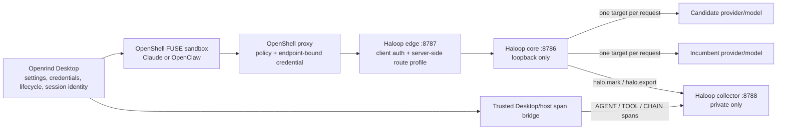

# Integrate w8-haloop with Openrind Shell FUSE sandboxes

## Issue metadata

- **Status:** In progress
- **Priority:** High
- **Owners:** TBD
- **Repositories:** `openeral` / `openrind-desktop`, `w8-haloop-main`
- **Suggested labels:** `integration`, `openshell`, `fuse`, `haloop`, `claude`, `openclaw`, `security`, `observability`
- **Target:** Required Haloop-backed inference for Claude and OpenClaw launched in OpenShell FUSE sandboxes

## Progress summary

- [ ] Phase 0: Confirm architecture, ownership, and threat model
- [ ] Phase 1: Build a secure routing-only MVP
- [ ] Phase 2: Capture complete Anthropic LLM spans
- [ ] Phase 3: Add trusted AGENT/TOOL span capture
- [ ] Phase 4: Enable HALO analysis, evals, and controlled rollout
- [ ] Phase 5: Package the integration and add Desktop UX/operations
- [ ] Complete live end-to-end validation for Claude and OpenClaw
- [ ] Complete security review and rollback exercise

## Implementation log

### 2026-09-04 — secure edge and provider foundation

- Added an Openrind profile resolver to the Haloop edge. It authenticates a
  scoped client token by SHA-256 hash, selects one server-owned route profile,
  injects trusted project/session/trace metadata, creates a unique request ID,
  strips sandbox credentials before the core, and rejects client routing or
  identity overrides.
- Added a protected profile-file contract (`W8_OPENRIND_PROFILES_FILE`) and
  documented the inline JSON variant as development/test-only.
- Added an endpoint-bound `haloop-anthropic` OpenShell provider limited to
  `host.openshell.internal:8787`, the Anthropic Messages endpoints, and the
  fixed Claude/OpenClaw native launchers. Generic Node is not authorized.
- Added and packaged a fixed Haloop configurator that removes persisted direct
  and legacy presigned routing state. The following lifecycle milestone connects
  it to the active sandbox path.
- Added non-streaming Anthropic response, tool-use, and token mapping to both
  Haloop span builders with matching TypeScript and Python tests.
- Verification completed: Haloop edge 36/36, Halo plugin 16/16, Python spanmap
  6/6, and focused Openrind Desktop contracts 13/13. The focused Rust provider
  test was added; native Windows execution is blocked by the missing GNU C
  toolchain, so the 2026-09-05 work runs it in a read-only Linux container.

### 2026-09-05 — Desktop lifecycle and mandatory sandbox cutover

- Added a Desktop-owned, serialized Haloop lifecycle manager. It verifies an
  image contract label, atomically stages the route registry through stdin,
  starts or replaces one managed container on fixed port `8787`, waits for its
  Docker health check, verifies unauthenticated inference is rejected, reports
  port conflicts without selecting another endpoint, and stops the runtime on
  clean Desktop exit. A foreign container using the reserved name is rejected
  without being stopped or replaced.
- Added stable client tokens scoped to the workspace, sandbox, and selected
  agent. Production tokens are encrypted with Electron `safeStorage`; only
  their SHA-256 hashes are written to the Haloop profile registry. The upstream
  Anthropic key remains in Desktop storage and the host-side registry.
- Cut sandbox provisioning and reconnect over to the scoped
  `haloop-anthropic` provider. Removed `--auto-providers`, the attached Claude
  and metered-gateway providers, and all upstream inference secrets from the
  PTY environment.
- Bumped the FUSE image contract to `fuse-haloop-required-v23`, made Claude and
  OpenClaw configuration use `http://host.openshell.internal:8787`, removed
  the legacy configurator from the image, and removed direct Anthropic and
  legacy proxy grants from the composed sandbox policy.
- Added lifecycle, scoped-token, policy, configuration, UI status/wording,
  development-image, and no-bypass contract tests. The focused Haloop/Openrind
  set passes 39 tests.
  Haloop now rejects
  expired and revoked client profiles without disclosing their state, and
  cross-scope tests confirm that each token resolves only its own server-owned
  route; the edge suite passes 39 tests. The labeled Haloop runtime image and
  `openrind-shell-fuse:local` both build, and the Haloop provider schema passes
  its focused Linux test. Streaming agent calls and production image packaging
  remain outstanding.
- Inspected both built image labels and filesystem contracts. A temporary
  loopback-only Haloop container reached healthy state, returned `200` from
  `/healthz`, rejected an unauthenticated `/v1/messages` request with `401`,
  and was removed after the smoke test.
- Added a dedicated Desktop-only **Global > Haloop** settings tab for the
  required Haloop edge. It reports the fixed endpoint, packaged image version,
  routing and collector health, active sandbox route, trusted-span counters,
  and the last sanitized connection error without exposing the client token or
  upstream credential. The tab polls while visible and provides refresh plus
  managed recovery actions. Environment remains the credential-entry surface;
  neither page has an enable/disable control or direct-provider fallback.
- A live Desktop status probe correctly failed closed because the local
  `haloop-gateway:local` image was present only in the host Docker daemon, not
  the dedicated OpenShell WSL Docker daemon. Source documentation and the
  runtime error now identify the required daemon explicitly. Publishing and
  pinning the production Haloop image remains an open packaging task.
- Added a source-checkout image builder that runs inside the dedicated
  OpenShell WSL Docker daemon and validates the FUSE contract plus Haloop
  contract/version labels after building. It supports focused and verify-only
  runs and avoids the previously ambiguous host-Docker build path.
- Ran that builder successfully: the WSL daemon now has
  `fuse-haloop-required-v23` and `openrind-haloop-v1` / version
  `w8-haloop-openrind-v1`. A real Desktop lifecycle smoke test with a fake
  upstream test value staged the root-owned mode-0600 registry, started the
  managed edge, passed its health and unauthenticated-401 checks, reported the
  scoped Claude route as ready, stopped cleanly, and removed the registry. The
  smoke did not send an upstream model request.

### 2026-09-05 — Anthropic streaming span reconstruction

- Added a bounded 4 MiB observer for direct Anthropic Messages SSE responses.
  It reconstructs message identity, ordered text/thinking/tool-use blocks,
  incremental tool JSON, final stop metadata, and final usage without changing
  the bytes delivered to Claude or OpenClaw.
- Deferred synchronous after-request observability hooks until the streamed
  Message JSON is complete. The agent response still starts immediately; these
  completion-time hooks are observational and cannot rewrite or deny content
  already delivered to the client.
- Added an explicit, content-free gateway error when cancellation, truncation,
  malformed events, invalid tool JSON, or the capture bound creates an
  observability gap. User traffic remains fail-open after Haloop has selected
  and begun the required route.
- Extended TypeScript and Python span mapping with Anthropic stop reason,
  stop sequence, cache-read tokens, cache-write tokens, and structured
  tool-result coverage. Streaming reconstruction passes 4/4 focused tests,
  the Halo plugin passes 18/18 tests, the edge remains 39/39, and the managed
  `w8-haloop-openrind-v2-stream-capture` runtime image was rebuilt and
  contract-verified.

### 2026-09-05 — mandatory private collector and Desktop capture lifecycle

- Added a dedicated `openrind-desktop-collector` image target with contract
  `openrind-haloop-collector-v1`. It runs as UID/GID `10001`, includes a
  `/healthz` check, exposes only container metadata for `8788`, and defaults to
  `W8_KEEP_RAW=0`.
- Extended the source-checkout builder to build and verify both version-matched
  Haloop images in the dedicated OpenShell WSL Docker daemon. The verified
  runtime version is `w8-haloop-openrind-v3-managed-collector`.
- Extended the Desktop lifecycle to create a labeled private Docker network,
  persist collector JSONL data under
  `/var/lib/openrind-desktop/haloop/collector-data`, and manage the gateway and
  collector as separate restartable containers. Only gateway port `8787` is
  published; collector `8788` has no host port binding.
- Every scoped, server-owned Claude/OpenClaw route now contains synchronous
  `halo.mark` and `halo.export` hooks with the fixed collector service URL and
  server-owned project. Desktop blocks new and resumed sessions until both
  containers are healthy, the gateway can reach the collector, and the edge
  rejects unauthenticated inference.
- Added separate gateway and trace-collector health in Settings. Clean Desktop
  exit stops both services and deletes the plaintext route registry while
  retaining captured traces.
- Verification completed: 25 focused Desktop lifecycle/contract tests pass;
  the w8 fork contract passes; both images build and their labels/versions
  verify; and a disposable collector smoke test ran healthy as `10001:10001`
  with no published ports. The broader Desktop wildcard suite still has
  unrelated baseline failures in concurrent process mocking and stale sandbox
  name expectations.

### 2026-09-06 — packaged Anthropic streaming capture acceptance

- Added a deterministic native Anthropic Messages endpoint to the traffic
  fixture. Its SSE response contains ordered text, split tool-input JSON, final
  stop metadata, and final token usage.
- Added a repeatable packaging acceptance that uses the version-matched Desktop
  gateway and collector images, an authenticated server-owned route profile,
  synchronous `halo.mark`/`halo.export` hooks, and no host port publishes.
- The acceptance rejects missing credentials and client route overrides,
  validates the emitted JSONL with the Halo trace validator, checks project,
  trace, session, model, provider, messages, tool ID/arguments, usage, and
  latency fields, confirms raw hook retention is disabled, and recreates the
  collector against the same named volume to prove persistence.
- The acceptance passes with runtime version
  `w8-haloop-openrind-v3-managed-collector`. It is a provider simulation and
  does not close the separate real Claude/OpenClaw validation gates.
- Ten traffic-fixture/acceptance contract assertions pass, the merged Compose
  configuration confirms that neither acceptance service has a port binding,
  and the updated w8 fork contract passes. The canonical Make target uses the
  Docker CLI directly so the dedicated OpenShell WSL daemon does not require a
  Compose plugin.

### 2026-09-06 — trusted Desktop span bridge foundation

- Added a deterministic, server-owned root AGENT span ID to every Openrind
  route profile. Haloop now injects that ID as `parent_span_id`, so gateway LLM
  spans join the Desktop-owned agent trace without trusting sandbox metadata.
- Added a host-only Desktop bridge for AGENT/TOOL/CHAIN events. It writes JSON
  through stdin to the private collector container, never publishes collector
  port `8788`, rejects LLM events so the gateway remains authoritative, and
  fixes project, trace, and session identity from the ready route.
- Added recursive secret-field redaction, bounded strings/objects, a 64 KiB
  per-span limit, 64-span/256 KiB batch limits, a 4 MiB per-trace limit, and
  capture counters for written, duplicate, dropped, redacted, and incomplete
  events. Post-route capture failures remain fail-open and visible in status.
- Added idempotent collector ingestion keyed by canonical trace/span ID,
  including restart persistence, and wired PTY completion/crash capture through
  a host lifecycle callback that renderer detach/reattach cannot replace.
- Verification completed: Desktop Haloop 10/10, PTY lifecycle 54/54, Desktop
  contract 17/17, Openrind edge profile 13/13, and collector/span-map 15/15.
  Real Claude/OpenClaw tool-session acceptance remains open; the shared event
  source decision is recorded in the next implementation entry.

### 2026-09-06 — gateway-derived trusted TOOL spans

- Evaluated Claude Code's documented `PreToolUse`, `PostToolUse`,
  `PostToolUseFailure`, and session lifecycle hooks, and OpenClaw's documented
  typed plugin hooks. These remain agent-runtime signals, so neither is allowed
  to write directly to the private collector.
- Made the authenticated gateway transcript the shared authoritative TOOL
  source: match a prior LLM response's tool call to the next LLM request's tool
  result, then emit a deterministic TOOL child of the exact calling LLM span.
- Added Anthropic and OpenAI-compatible result mapping, failed-tool status,
  64 KiB derived input/output bounds, session matching, and persistent
  idempotency across repeated full-history requests and collector restarts.
- Extended the packaging acceptance to simulate the Desktop root AGENT, perform
  a complete Anthropic tool-use/result round-trip, and validate the persisted
  AGENT -> LLM -> TOOL hierarchy. The updated container acceptance still needs
  to be rerun because Docker was unavailable during this implementation pass.
- Verification completed: collector/span-map and traffic-fixture checks 30/30,
  Halo plugin 18/18, and Openrind edge 39/39. The broader Python suite still
  requires its separate HALO/Harbor optional dependencies.

### 2026-09-06 — explicit Desktop agent termination capture

- Extended the Desktop-owned PTY lifecycle callback with a trusted termination
  cause and close-request timestamp. It now distinguishes normal completion,
  process crashes, explicit Desktop cancellation, sandbox deletion, and app
  shutdown without trusting agent or renderer metadata.
- Added a single lifecycle-event builder for Claude and OpenClaw AGENT spans.
  Cancellation, deletion, shutdown, and non-zero exits are recorded as errors;
  a zero exit is recorded as a successful completion. Capture remains
  best-effort after the required Haloop route has begun serving traffic.
- Added focused coverage for natural process exit, explicit Desktop close,
  sandbox deletion, and app-shutdown termination causes. Verification completed:
  Haloop runtime and PTY lifecycle checks 66/66, plus syntax checks for all changed Electron
  modules. The broader Desktop OpenShell suite remains environment-sensitive on
  this Windows invocation and reported unrelated executable/spawn fixture
  failures before and alongside the passing focused surface.
- Resume trace isolation is implemented at the Desktop/edge contract. The
  canonical trace is no longer owned only at sandbox/agent scope. Desktop now
  issues a profile-bound HMAC assertion per conversation, delivers it through
  Claude/OpenClaw's per-process header configuration, and keeps only its opaque
  context ID in PTY state for reattach. The edge rejects missing, expired,
  forged, and cross-profile assertions, derives trace/root/session IDs itself,
  and strips the assertion before the core. Same-session resumes retain the
  context; unrelated Desktop conversations receive distinct trace identities.

### 2026-09-06 — Trusted per-conversation trace routing

- Added the mandatory `x-openrind-haloop-session` edge contract. The protected
  profile registry now stores a derived session HMAC key and session prefix
  instead of a single sandbox-wide trace/root/session identity.
- Desktop hashes its session identity into an opaque 128-bit context, signs a
  bounded assertion, records the matching route-root AGENT span, and writes the
  assertion into the consume-once launch marker. Raw Desktop/user session IDs
  are absent from the assertion and trace metadata.
- Claude receives the signed header through `ANTHROPIC_CUSTOM_HEADERS`; OpenClaw
  resolves the same process environment value from its custom provider headers.
  Both launch paths fail closed when the assertion is absent or malformed.
- The edge authenticates the existing endpoint-bound profile token first,
  verifies the assertion against that profile, derives canonical metadata, and
  removes the assertion and credentials before proxying. It still rejects every
  client-owned `x-w8-haloop-*` override.
- Bumped the FUSE contract to `fuse-haloop-required-v24` and the Haloop gateway
  contract to `openrind-haloop-v2`. The FUSE image now requires a Claude Code
  release with supported custom headers.
- Added unit and edge integration coverage for missing/forged/expired/
  cross-profile assertions, resume stability, conversation isolation, header
  stripping, and host-side identity parity. Real Claude/OpenClaw and Docker
  packaging acceptance remain open.
- Verified the OpenShell governed REST forwarding boundary used by the fixed
  Haloop endpoint. A focused proxy contract now proves that OpenShell resolves
  the endpoint-bound token placeholder while preserving the signed conversation
  assertion unchanged for the edge. This is deliberately separate from
  OpenShell's `inference.local` route allowlist.
- Tightened the Desktop launch marker to the same lowercase assertion grammar
  enforced by the edge. Expired contexts recover by terminating and relaunching
  the agent from Desktop; a live PTY reattach intentionally keeps the existing
  process and cannot replace a header already loaded by that process.
- Validation for this increment: the focused Desktop launch and contract tests,
  Electron syntax check, Rust formatting check, and repository whitespace check
  pass. The focused Rust proxy test is source-valid but still needs execution in
  a Linux/build image: this workstation's Windows GNU target lacks `gcc` and
  `dlltool`, Ubuntu has no Cargo installed, and the Docker daemon is unavailable.

### 2026-09-07 — Managed recovery and trace-gap status

- Added a Desktop-owned **Restart Haloop** action for the last active route. It
  stops and recreates only the managed gateway and private collector, rebuilds
  the server-owned registry from encrypted state, and does not recreate or
  modify the OpenShell sandbox or FUSE workspace.
- The restart reuses the stable scoped profile/token, so assertions already held
  by live agent processes remain valid. The action is unavailable when there is
  no prior Desktop route or when a foreign reserved container/network blocks
  safe ownership checks.
- Runtime status now retains the last active route while managed services are
  degraded, exposes bounded trusted-span capture counters, and shows an explicit
  warning when the collector is interrupted or Desktop span capture drops data.
  Routing stays on Haloop; no direct-provider fallback is added.
- Focused runtime, launch, and Desktop contract tests pass, including managed
  restart, degraded-route retention, no-route rejection, trace-gap reporting,
  and the lowercase signed-context boundary. Electron syntax checks pass. The
  application type checker reaches only pre-existing billing/recharts errors and
  reports no errors in the changed Haloop settings files.

### 2026-09-07 — Scoped-token rotation and forced relaunch

- Added an explicit **Rotate token** action for the exact active
  workspace/sandbox/agent profile. Desktop verifies the route identity again in
  the main process, refuses to create a missing scope, and never returns either
  the old or replacement token to the renderer.
- Rotation ends tracked in-app agents first, withdraws the managed edge serving
  the old token, replaces only that profile's encrypted token, rebuilds the
  server-owned registry, and refreshes the endpoint-bound OpenShell provider.
  Other scoped profile tokens remain unchanged.
- New/reconnecting agents are blocked while their sandbox token is rotating.
  The FUSE sandbox and workspace are preserved, but affected in-app and external
  agent processes must relaunch to receive a newly signed conversation context.
- A failed rebuild remains fail-closed. The encrypted replacement token is the
  recovery source for the next managed ensure; no direct-provider path or stale
  token fallback is introduced.
- Focused credential, runtime, PTY lifecycle, and Desktop contract tests pass,
  as do Electron syntax and repository whitespace checks. The application type
  checker reports only the existing billing/recharts errors outside this slice.

### 2026-09-07 — Sandbox-removal revocation

- Desktop sandbox deletion now enters credential maintenance before teardown,
  blocks new launches, waits for any bounded open sequence, and ends every
  tracked agent session for that sandbox.
- The managed Haloop edge is withdrawn before OpenShell provider records and
  encrypted scoped tokens are removed. Cleanup failure aborts sandbox deletion,
  leaving the operation fail-closed and retryable instead of silently retaining
  a serving credential.
- After revocation, Desktop atomically rebuilds the edge registry from surviving
  workspace/sandbox/agent profiles without changing their tokens or FUSE data.
  Removing the final profile stops the gateway and collector while retaining the
  private trace store.
- Focused credential, runtime-lifecycle, and Desktop contract checks cover
  callback ordering, retry safety, surviving-profile rebuild, last-profile
  shutdown, and revocation-before-deletion. Syntax checks also pass.

### 2026-09-07 — Incumbent-only route recovery

- Desktop route registries now declare an `incumbent-only` policy backed by one
  direct Anthropic configuration with no candidate targets, weights, or model
  override. The sandbox cannot select or change this policy.
- Added a confirmed **Restore incumbent** action for the exact active route.
  Desktop revalidates the route identity and managed-container ownership,
  atomically restages the server-owned registry, and replaces only the gateway.
- Scoped tokens, signed conversation keys, existing agent processes, the private
  collector, trace data, and FUSE workspace remain unchanged. A request already
  in flight during the bounded edge replacement may need to be retried. Restore
  requires a healthy version-matched collector; full-service repair uses the
  existing managed restart first.
- A failed restore remains fail-closed on Haloop and records an actionable
  runtime error. Focused runtime and Desktop contract tests cover stale-route
  rejection, no-route rejection, secret confinement, collector preservation,
  profile/session stability, and the explicit Settings action.

### 2026-09-07 — Full integration-reset revocation

- Confirmed **Reset distro** now places the complete Haloop integration in
  maintenance, blocks new Claude/OpenClaw route preparation, and waits for any
  preparation or session-marker handshake that was already in progress.
- Desktop closes every tracked agent, withdraws the public Haloop edge, deletes
  all endpoint-bound OpenShell providers, and only then removes every encrypted
  scoped client profile. If a corrupt runtime prevents managed cleanup, Desktop
  terminates the dedicated distro first and erases the encrypted host profiles;
  unregister then destroys the inaccessible provider store. Failure to stop the
  distro or erase host tokens aborts unregister.
- On the normal cleanup path, Desktop also removes the private collector,
  plaintext route registry, and managed Docker network before unregistering the
  dedicated distro. This destructive recovery deletes distro-local trace data
  and sandbox packages; the external PostgreSQL FUSE workspace is not deleted.
- Focused credential, runtime, PTY, and Desktop contract tests cover ordering,
  retry safety, the global Haloop-operation barrier, managed-service cleanup,
  stopped-distro quarantine, and revocation-before-unregister. Electron syntax
  checks also pass.

## Summary

Integrate `w8-haloop-main` as the required Anthropic-compatible inference gateway for Claude and OpenClaw sessions launched inside Openrind Shell's OpenShell FUSE sandbox.

Haloop must run outside the sandbox. The sandbox should reach only Haloop's authenticated edge through the OpenShell proxy and an endpoint-bound credential. Haloop should retain the real upstream provider credentials, select one configured model target per request, and keep its collector private.

The integration is feasible, but the current repositories need additional work before it is secure and before Haloop can claim complete Claude/OpenClaw traces. The routing-only path is the first milestone. Full observability requires server-side route profiles, Anthropic response mapping, streaming capture, and trusted application span ingestion.

## Goals

- Route Claude Code's Anthropic Messages requests through the Haloop edge.
- Route OpenClaw's `anthropic-messages` provider through the same edge.
- Preserve OpenShell endpoint-bound credential injection and executable-identity enforcement.
- Keep upstream provider keys outside the sandbox, workspace, agent configuration, logs, and traces.
- Support incumbent/candidate selection with exactly one target serving each request.
- Capture replayable Anthropic LLM spans, including tool-use content and token usage.
- Correlate LLM spans with an Openrind workspace and agent session.
- Add trusted AGENT/TOOL spans without exposing the Haloop collector to the sandbox.
- Make Haloop the required inference path for this next phase, with recovery and rollback occurring inside the Haloop architecture rather than bypassing it.

## Non-goals

- Do not run the Haloop gateway or collector inside the FUSE sandbox.
- Do not mount Haloop data, reports, routing configuration, or provider credentials into `/sandbox/work`.
- Do not expose collector port `8788` to sandbox processes, LAN peers, or VPN peers.
- Do not authorize generic `/usr/bin/node` to use the inference credential.
- Do not send upstream provider keys in `x-w8-haloop-config` or other sandbox-controlled headers.
- Do not describe weighted routing as mirrored or shadow traffic. Haloop selects one target per request.
- Do not claim complete traces until streaming output and application spans are proven end to end.
- Do not automatically deploy a new routing configuration produced by the Haloop rollout script.
- Do not treat HALO citations as failure labels or deterministic structural checks as proof of general task success.
- Do not provide a user setting, feature flag, or automatic fallback that bypasses Haloop for direct provider access.

## Required cutover behavior

- [x] Haloop is the required inference path for all newly created Claude and OpenClaw FUSE sandboxes.
- [x] Existing/resumed Claude and OpenClaw FUSE sessions are migrated to Haloop before launch.
- [x] Sandbox creation or agent launch fails with a clear actionable error when the Haloop edge, authentication, or route profile is unavailable.
- [x] There is no `Use Haloop` toggle and no supported direct-provider bypass after the cutover.
- [x] Operational recovery uses Haloop restart/reconnect, token rotation, or incumbent-only Haloop routing.
- [x] A full application-version rollback may restore the previous release, but the new-phase runtime does not silently fall back around Haloop.

## Baseline at issue creation

### Openrind Shell / OpenShell

- `openrind-desktop/apps/desktop/electron/openshell/fuse-sandbox.mjs` creates the sandbox with `--fuse`, attaches the `claude` provider, and forwards provider credentials to the OpenShell control plane.
- `vendor/openshell/providers/claude-code.yaml` binds the Claude credential to `api.anthropic.com:443` and authorizes the fixed Claude/OpenClaw launch executables.
- `sandboxes/openeral/policy.yaml` allows Anthropic access only for the fixed Claude/OpenClaw binary paths.
- `sandboxes/openeral/configure-stringcost.mjs` can configure Claude's `ANTHROPIC_BASE_URL`.
- `sandboxes/openeral/configure-openclaw-fuse.mjs` registered a dedicated OpenClaw provider with `api: "anthropic-messages"` and targeted `https://api.anthropic.com`.
- OpenShell's Docker driver provides `host.openshell.internal` as the stable host-service address. Sandbox clients must not use `localhost` for a host-side Haloop service.

### w8-haloop

- `src/index.ts` exposes `/v1/messages` and `/v1/messages/count_tokens`.
- `w8-edge/server.ts` exposes the public edge on port `8787`; the inherited routing core remains private on loopback port `8786`.
- Requests currently depend on request-local `x-w8-haloop-config` routing and `x-w8-haloop-metadata` correlation headers.
- Routing configurations may contain upstream API keys, which makes the current request-local contract unsuitable for an untrusted sandbox.
- `plugins/halo/export.ts` currently maps OpenAI-shaped responses using `choices[].message` and `prompt_tokens` / `completion_tokens`.
- Anthropic Messages responses use `content[]` and `input_tokens` / `output_tokens`, so routing is possible but the current exporter would produce incomplete trace data.
- The current hook context does not accumulate the complete body of a streaming response.
- Gateway hooks capture only LLM calls. The application must provide surrounding AGENT/TOOL/CHAIN spans.
- The collector on port `8788` has no built-in authentication or tenant boundary and must remain private.

## Target architecture

## Required security invariants

- [x] Haloop is required for Claude and OpenClaw FUSE inference in this phase.
- [x] The sandbox receives only a scoped Haloop client credential, never an upstream provider key.
- [x] The scoped credential is bound to the exact Haloop host and port by OpenShell.
- [x] The request endpoint and attached provider endpoint are identical; an endpoint mismatch fails closed.
- [x] Only the native Claude/OpenClaw launch identities can use the credential.
- [x] No sensitive endpoint is granted to generic `/usr/bin/node`, a script path, argv content, or another spoofable identity.
- [x] Client-supplied routing configuration cannot override the server-owned route profile.
- [x] Client-supplied metadata cannot select another tenant/project or impersonate another workspace.
- [x] Upstream provider keys remain in the Haloop host/control-plane environment or protected Desktop credential storage.
- [ ] Secrets are absent from tracked files, Compose files, request bodies, exported traces, reports, eval cases, terminal output, and application logs.
- [x] The Haloop core remains loopback-only and is never published.
- [x] The Desktop collector runs unprivileged on a managed private network with no host port publish; direct sandbox access is impossible.
- [ ] Any public or non-loopback Haloop edge deployment requires TLS and authenticated client access.
- [ ] Trace data receives an explicit retention/redaction policy before production use.

## Recommended design decisions

These are the proposed defaults. Any change should be documented in this issue before implementation.

| Decision | Recommendation |
| --- | --- |
| Runtime location | Run Haloop outside the FUSE sandbox, preferably managed by Openrind Desktop for the local integration. |
| Local endpoint | Use `http://host.openshell.internal:8787` only for a local, authenticated development/Desktop path. |
| Production endpoint | Use a stable HTTPS hostname with the same endpoint-bound OpenShell provider contract. |
| OpenShell provider | Add a dedicated `haloop-anthropic` provider/profile instead of repurposing `claude`. |
| OpenClaw provider ID | Use a distinct ID such as `openrind-haloop`; keep `api: "anthropic-messages"`. |
| Credential | Store a revocable Haloop client token separately from the upstream Anthropic credential. |
| Routing | Resolve a server-owned route profile from the authenticated client/workspace; reject arbitrary sandbox route graphs. |
| Correlation | Generate a unique request ID at the trusted edge and bind project/trace/session identity to trusted Desktop state. |
| Collector access | Gateway plugins and a trusted host bridge may reach it; sandbox processes may not. |
| Rollback | Keep traffic inside Haloop and switch to an incumbent-only Haloop route; use a full application-version rollback only for release recovery. |

## Phase 0: Architecture, threat model, and ownership

### Tasks

- [x] Use a Desktop-started/stopped, contract-labeled Haloop container for the local runtime.
- [x] Use `http://host.openshell.internal:8787` for the authenticated local path; reserve a stable HTTPS origin for a future production endpoint.
- [x] Desktop safe storage and the host-side Haloop registry own upstream provider credentials.
- [x] Define the scoped Haloop client-token format, explicit rotation, compromised-profile invalidation, and sandbox-removal revocation behavior.
- [ ] Define the token lifetime and any automatic rotation interval.
- [x] Scope client tokens to the workspace, sandbox, and selected agent.
- [x] Store token ciphertext in Desktop credentials and atomically rebuild the mode-0600 host-side Haloop registry.
- [x] Define how an Openrind workspace ID and agent session ID map to a Haloop project and trace.
- [x] Treat routing-only as the completed first milestone, then require private collector capture for the next-phase Claude/OpenClaw path.
- [x] Define emergency recovery as Haloop restart/reconnect, client-token rotation, incumbent-only Haloop routing, or full application-version rollback; do not add a direct runtime bypass.
- [ ] Document trace retention, redaction, deletion, and access-control requirements.
- [ ] Threat-model sandbox attempts to:
  - [x] reuse the client token against another endpoint;
  - [x] submit a route containing an attacker-controlled host;
  - [x] select another project/workspace;
  - [x] duplicate or forge request IDs;
  - [x] post directly to the collector;
  - [x] obtain an upstream key from environment, config, errors, or logs;
  - [x] invoke the credential through a generic interpreter.

### Exit criteria

- [ ] Architecture and threat-model decisions are recorded in this issue.
- [ ] The credential owner, route-profile owner, session identity source, and rollback behavior are unambiguous.
- [x] No implementation depends on secrets supplied through sandbox-controlled routing JSON.

## Phase 1: Secure routing-only MVP

### 1A. Haloop edge authentication and server-side profiles

- [x] Add authenticated client access for the general `/v1/messages` path.
- [x] Store only a hash or otherwise protected representation of client tokens where practical.
- [x] Add a server-side route-profile registry or resolver.
- [x] Map the authenticated client/workspace to exactly one allowed route profile.
- [x] Inject the internal routing configuration after authentication.
- [x] Reject client attempts to override provider keys, custom hosts, collector URLs, guardrail hooks, or route targets.
- [x] Generate a unique `request_id` for every model call at a trusted boundary.
- [x] Assign a safe server-owned project identifier.
- [x] Preserve only the public `x-w8-haloop-*` contract; do not expose or accept `x-portkey-*` publicly.
- [x] Keep `8786` loopback-only.
- [x] Add negative tests for missing, invalid, expired, revoked, and wrong-scope tokens.
- [x] Add negative tests for route/header override attempts.

### 1B. Haloop runtime packaging

- [x] Use one Desktop-managed Haloop gateway image/container for routing-only; do not run the full Compose stack in this phase.
- [x] Add bounded startup, health checking, restart, and graceful shutdown behavior.
- [x] Ensure port conflicts produce a clear error rather than silently selecting an untracked endpoint.
- [ ] Restrict the edge bind appropriately for the selected runtime and require authentication even on the local path.
- [x] Do not start or publish collector `8788` in the routing-only Desktop runtime.
- [x] Keep runtime state under the managed WSL user state directory rather than either Git worktree.
- [x] Add Desktop-visible health details without printing tokens, route secrets, or provider keys.

### 1C. Dedicated OpenShell provider

- [x] Add/import a dedicated endpoint-bearing Haloop provider profile.
- [x] Bind its credential to the exact Haloop endpoint.
- [x] Map the scoped Haloop token into the Anthropic client's expected credential header without exposing the plaintext token inside the sandbox.
- [x] Restrict the profile to the fixed Claude/OpenClaw executables.
- [x] Update `sandboxes/openeral/policy.yaml` with the exact Haloop host/port and REST enforcement.
- [x] Audit the composed policy and image to confirm another policy does not effectively grant the endpoint to `/usr/bin/node`.
- [x] Remove `--auto-providers` and attach only the scoped Haloop inference provider.
- [x] Add endpoint-mismatch and unauthorized-executable contract tests.

### 1D. Claude configuration

- [x] Make Haloop the required inference path in sandbox provisioning.
- [x] Set Claude's base URL to the Haloop origin without a trailing `/v1` because Claude appends `/v1/messages`.
- [x] Remove the current direct Anthropic/Openrind Gateway path from the active new-phase runtime after the Haloop cutover.
- [x] Remove stale base URLs and direct-provider credentials from generated settings and the PTY environment.
- [ ] Verify new Claude sessions and resumed Claude sessions always use Haloop.

### 1E. OpenClaw configuration

- [x] Register a distinct `openrind-haloop` OpenClaw provider.
- [x] Keep `api: "anthropic-messages"` and an explicit provider-prefixed model allowlist.
- [x] Set its base URL to the Haloop origin without a trailing `/v1`.
- [x] Do not let the provider inherit Claude's unrelated `ANTHROPIC_BASE_URL`.
- [x] Remove stale direct-provider data during migration to the required Haloop provider.
- [ ] Verify new OpenClaw sessions and resumed OpenClaw sessions always use Haloop.

### Phase 1 acceptance criteria

- [ ] Claude completes a real streaming `/v1/messages` request through Haloop.
- [ ] OpenClaw completes a real streaming `/v1/messages` request through Haloop.
- [ ] The actual upstream target is selected by the server-owned route profile.
- [ ] A sandbox-controlled route/header cannot change the upstream provider or host.
- [ ] No upstream provider credential exists in the sandbox environment, Claude settings, OpenClaw config, FUSE workspace, or logs.
- [ ] The scoped Haloop credential fails against non-Haloop endpoints.
- [ ] An unauthorized executable cannot use the Haloop credential.
- [x] Haloop recovery or incumbent-only route rollback does not recreate or lose the FUSE workspace.
- [ ] Routing is described as one selected target per request; no shadow-traffic claim is made.

## Phase 2: Complete Anthropic LLM capture

### 2A. Anthropic request/response mapping

- [x] Add a first-class Anthropic Messages mapping to `plugins/halo/export.ts`.
- [x] Update `halo-loop/services/collector/spanmap.py` to preserve behavioral parity.
- [x] Preserve the request model, system prompt, messages, tool schemas, tool choice, max tokens, temperature, and other replay-relevant invocation parameters.
- [ ] Normalize Anthropic response `content[]` blocks, including:
  - [x] text;
  - [ ] thinking/redacted-thinking where permitted by retention policy;
  - [x] tool use and tool identifiers;
  - [x] stop reason and stop sequence;
  - [x] response ID and model.
- [x] Map `usage.input_tokens`, `usage.output_tokens`, total tokens, and supported cache-token fields.
- [x] Preserve tool-result input blocks without flattening away identifiers or structured content.
- [ ] Add fixtures for text-only, tool-use, tool-result, mixed-content, and error-shaped responses.

### 2B. Streaming reconstruction

- [x] Add a bounded streaming capture path for Anthropic SSE events.
- [x] Reconstruct `message_start`, content-block start/delta/stop, `message_delta`, and `message_stop` into one replayable response.
- [x] Preserve the exact response delivered to Claude/OpenClaw; capture must not rewrite model content or tool arguments.
- [x] Define and enforce a maximum capture size.
- [x] Record a visible observability gap if stream reconstruction fails while allowing user traffic to follow the chosen fail-open/fail-closed policy.
- [x] Capture client cancellation, provider timeout, and truncated streams as explicit incomplete/error telemetry where possible.
- [ ] Do not claim complete failure telemetry while the HTTP-200-only after-hook limitation remains.

### 2C. Trace identity and validation

- [x] Emit canonical 32-hex `trace_id` values.
- [x] Emit a unique `request_id` per LLM call.
- [x] Add stable `session_id` and a required Desktop route-root
  `parent_span_id` from trusted session state.
- [x] Keep project names server-owned and non-empty.
- [x] Validate every produced trace with Haloop's trace validator before analysis.
- [ ] Confirm `halo.mark` and `halo.export` timing correlation cannot be corrupted by duplicate IDs.
- [x] Confirm missing collector availability blocks new/resumed sessions, remains visible as distinct health, and does not leak secrets.

### Phase 2 acceptance criteria

- [x] Non-streaming Anthropic text and tool-use fixtures produce valid HALO LLM spans.
- [x] The packaged deterministic Anthropic SSE path produces replayable text,
  tool use, correct token counts, synchronous timing correlation, and a
  persisted validator-clean span without publishing the collector.
- [ ] Streaming Claude and OpenClaw requests produce replayable output messages and correct token counts.
- [x] TypeScript and Python span builders pass cross-language parity tests.
- [x] Trace validation passes with project, model, provider, message, usage, and latency fields present where supported.
- [x] No captured response content is changed before reaching the agent.
- [ ] Known missing visibility for non-200/timeouts is documented until implemented.

## Phase 3: Trusted AGENT/TOOL span capture

### Research and design

- [x] Evaluate [Claude Code's supported hooks/session records](https://code.claude.com/docs/en/hooks)
  for trustworthy agent and tool events.
- [x] Evaluate [OpenClaw's typed plugin hooks](https://github.com/openclaw/openclaw/blob/main/docs/plugins/hooks.md)
  and [automation hooks](https://github.com/openclaw/openclaw/blob/main/docs/automation/hooks.md)
  for the same data.
- [x] Use live capture through a Desktop-owned bridge; persisted session
  artifacts may be used only as a recovery source after their trust contract is
  defined.
- [x] Use a deterministic route-root AGENT span as the gateway LLM parent;
  Desktop AGENT/CHAIN/TOOL events use explicit canonical parent IDs beneath the
  same root. For common Anthropic/OpenAI-compatible tool round-trips, the
  gateway transcript supplies the exact LLM/tool correlation without trusting
  an agent-specific collector writer.
- [x] Redact secret-bearing keys recursively, truncate content and structure at
  fixed bounds, omit Desktop user/conversation identifiers from attributes,
  and persist only sanitized error summaries.

### Implementation

- [x] Add a trusted Desktop/host bridge for AGENT/TOOL/CHAIN spans.
- [x] Do not give the sandbox direct network access to collector `/spans`.
- [x] Use the same canonical trace ID as the Haloop LLM calls.
- [x] Use explicit parent span IDs to connect LLM calls and tool executions to the agent hierarchy.
- [x] Ensure duplicate ingestion is idempotent or detectably rejected.
- [x] Derive TOOL spans from matched gateway-observed tool calls/results with a
  deterministic span ID and the calling LLM as parent.
- [x] Bound span size and total session capture.
- [x] Surface dropped/redacted/incomplete span counts through runtime status.
- [x] Add crash and collector-restart cases.
- [x] Add explicit Desktop cancellation and termination-cause capture.
- [x] Add resume trace-isolation cases using the signed per-conversation routing
  context.

### Phase 3 acceptance criteria

- [ ] One Claude tool-use session produces a valid AGENT -> LLM -> TOOL hierarchy.
- [ ] One OpenClaw tool-use session produces the same hierarchy.
- [x] Resumed session contexts retain their trace while unrelated contexts
  receive different canonical trace IDs at the edge.
- [ ] The sandbox cannot post arbitrary spans directly to the collector.
- [ ] Sensitive content follows the documented redaction and retention policy.
- [ ] A collector outage blocks new/resumed sessions but does not alter model traffic already in flight after Haloop selected the required route.

## Phase 4: HALO analysis, evals, and controlled rollout

### Trace analysis

- [ ] Run HALO only after trace validation passes.
- [ ] Confirm the analysis entrypoint continues to use the chat-completions surface required by the vendored engine.
- [ ] Confirm reports cite only trace/span IDs present in the selected project input.
- [ ] Treat HALO citations as interesting evidence, not automatic failure labels.
- [ ] Store reports outside tracked source and apply the retention policy.

### Eval generation and replay

- [ ] Decide whether Anthropic Messages traces are replayed through `/v1/messages` or normalized to the existing chat-completions eval surface.
- [ ] Preserve complete message prefixes, tool schemas, tool IDs, and provider/model identity.
- [ ] Add Claude/OpenClaw cases for valid tool use, invalid tool name, invalid tool arguments, refusals, empty output, and truncated streams.
- [ ] Separate deterministic structural checks from semantic task-success evaluation.
- [ ] Record which model/provider produced each replay result.

### Controlled routing

- [x] Begin with one incumbent route and zero candidate traffic.
- [ ] Introduce candidate traffic with an explicitly reviewed small weight.
- [ ] Confirm each request is served by exactly one branch.
- [ ] Define pass-rate, p99 latency, trace-completeness, and optional cost thresholds.
- [ ] Require a human-reviewed configuration change before increasing traffic.
- [x] Preserve immediate manual rollback to the incumbent route.
- [ ] Do not automatically deploy `*.next.json` output from the rollout script.

### Phase 4 acceptance criteria

- [ ] A validated Claude trace and a validated OpenClaw trace can be analyzed.
- [ ] Generated eval cases replay without losing Anthropic tool semantics.
- [ ] Candidate/incumbent results identify the actual selected model.
- [ ] Promotion/hold output is reproducible from committed configuration plus uncommitted sensitive runtime evidence.
- [ ] The rollout changes configuration only after explicit operator review.

## Phase 5: Desktop UX, packaging, and operations

### Desktop settings and status

- [x] Add required Haloop connection and route status; do not add an enable/disable toggle.
- [x] Put Haloop runtime status and recovery actions in a dedicated Desktop-only Global settings tab; keep Environment focused on credentials.
- [x] Keep the endpoint and connection mode fixed to the Desktop-managed host service; display the endpoint read-only and never display stored secrets.
- [x] Generate and persist scoped Haloop client tokens in `safeStorage`; do not expose them as user-entered settings or renderer values.
- [x] Show gateway health, active Haloop route/profile, and last connection error.
- [x] Distinguish routing health from trace/collector health.
- [x] Show when routing may have continued but private or trusted-span trace capture was incomplete.
- [x] Preserve session reconnect through the Desktop PTY owner without bypassing Haloop.
- [x] Provide a managed Haloop restart that preserves the FUSE workspace and active profile identity.
- [x] Provide explicit scoped-token rotation with affected-session relaunch.
- [x] Revoke every scoped token and endpoint-bound provider before its sandbox is deleted.
- [x] Invalidate a compromised active profile through explicit token rotation and affected-session relaunch.
- [x] Revoke all remaining scoped tokens/providers when the entire integration is removed.
- [x] Provide an approved incumbent-only route selector and rollback action.
- [x] Expose route, gateway, collector, capture-gap, and last-error diagnostics without secrets.

### Lifecycle and packaging

- [ ] Package a pinned Haloop version/image rather than running an arbitrary checkout.
- [x] Record the contract-validated Haloop image version in diagnostics.
- [x] Start and verify Haloop before creating or connecting any Claude/OpenClaw FUSE sandbox.
- [x] Use bounded readiness and shutdown timeouts.
- [x] Stop both managed containers and delete the plaintext profile registry on clean application exit.
- [x] Persist traces across Desktop restart under `/var/lib/openrind-desktop/haloop/collector-data`.
- [ ] Add upgrade and downgrade handling for route-profile and trace schema versions.

### Phase 5 acceptance criteria

- [ ] A user can create a FUSE sandbox, launch either agent through required Haloop routing, and see a clear ready state.
- [ ] A user can recover or switch to an incumbent-only Haloop route without losing workspace data.
- [x] Gateway failure, collector failure, authentication failure, and endpoint mismatch have distinct messages.
- [ ] Packaged services are versioned, health-checked, and cleaned up according to the lifecycle policy.

## File-level implementation map

### `openeral` / `openrind-desktop`

| Concern | Existing or proposed location |
| --- | --- |
| Sandbox provider creation/attachment | `openrind-desktop/apps/desktop/electron/openshell/fuse-sandbox.mjs` |
| OpenShell provider profile | `vendor/openshell/providers/` or an imported custom profile managed by Desktop |
| Effective network policy | `sandboxes/openeral/policy.yaml` |
| Claude base URL configuration | `sandboxes/openeral/configure-haloop.mjs` |
| OpenClaw provider configuration | `sandboxes/openeral/configure-openclaw-fuse.mjs` |
| Session environment and launch | `sandboxes/openeral/setup-fuse.sh` |
| Claude launch/session identity | `sandboxes/openeral/openrind-desktop-claude-launch.sh` and the FUSE session hook |
| OpenClaw trusted launcher | `sandboxes/openeral/openclaw-agent-launcher.c` and `sandboxes/openeral/openrind-openclaw-fuse.sh` |
| Haloop process lifecycle | `openrind-desktop/apps/desktop/electron/openshell/haloop-runtime.mjs` |
| Credential storage/UI | Existing Desktop credential store and Environment settings domain |
| Contract tests | `openrind-desktop/apps/desktop/__tests__/openshell/` and sandbox policy/config tests |

### `w8-haloop-main`

| Concern | Existing or proposed location |
| --- | --- |
| Public client auth/profile resolution | `w8-edge/server.ts` plus a server-owned profile module/store |
| Public header translation | `w8-edge/branding.ts` |
| Anthropic endpoint | `src/index.ts` and Anthropic provider handlers |
| First-class span exporter | `plugins/halo/export.ts` |
| Cross-language span parity | `halo-loop/services/collector/spanmap.py` |
| Collector ingestion/storage | `halo-loop/services/collector/` |
| Runtime ports/binds/lifecycle | `halo-loop/compose.yaml`, `ecosystem.config.cjs`, `runtime-supervisor.cjs` |
| Routing templates | `halo-loop/configs/` with no real keys committed |
| Trace/eval validation | `halo-loop/scripts/`, `halo-loop/evalgen/`, and e2e suites |

## Validation matrix

### Static and unit validation

- [x] Provider/profile schema validates.
- [x] Composed policy grants the Haloop endpoint only to the intended native identities.
- [x] Claude base URL is exactly the required Haloop origin.
- [x] OpenClaw provider uses `anthropic-messages`, the expected base URL, and explicit model registration.
- [x] No conflicting Anthropic provider attachment is present.
- [ ] No upstream provider key or real routing secret appears in tracked files.
- [x] Haloop rejects public `x-portkey-*` headers.
- [x] Haloop rejects client route/profile override attempts.
- [x] Anthropic and OpenAI span mappings remain behaviorally compatible with their fixtures.

### Openrind focused checks

- [x] `node --check openrind-desktop/apps/desktop/electron/openshell/fuse-sandbox.mjs`
- [x] `node --test openrind-desktop/apps/desktop/__tests__/openshell/fuse-desktop-contract.test.mjs`
- [x] Relevant OpenClaw configuration and policy contract tests.
- [ ] `cargo fmt --all --check`
- [ ] `cargo test -p openeral-fused`
- [x] Build `openrind-shell-fuse:local` when image or provisioning files change.
- [ ] Run the real OpenShell FUSE E2E with a writable PostgreSQL workspace when the local gateway and provider are available.

### Haloop focused checks

- [x] Dockerized `git-pre-push` target: formatting, edge/plugin tests, fork contract, and PM2 resilience/shutdown probes.
- [ ] `make build && make test-plugins`
- [ ] `npm run test:contract`
- [ ] `make loop-test`
- [ ] `make loop-test-e2e`
- [ ] `make sample-traffic-smoke`
- [ ] `make loop-docker-resilience` when Compose/runtime behavior changes.
- [ ] `make loop-validate` against captured Claude and OpenClaw traces.
- [ ] Bring all development services down after validation and report what remains running.

### Live agent matrix

| Scenario | Claude | OpenClaw |
| --- | --- | --- |
| New session | [ ] | [ ] |
| Resume existing session | [ ] | [ ] |
| Streaming text response | [ ] | [ ] |
| Tool call and tool result | [ ] | [ ] |
| Long/multi-turn context | [ ] | [ ] |
| Provider 401/403 | [ ] | [ ] |
| Provider 429/retry/fallback | [ ] | [ ] |
| Client cancellation | [ ] | [ ] |
| Haloop edge restart | [ ] | [ ] |
| Collector unavailable | [ ] | [ ] |
| Recover/restart Haloop and use incumbent-only route | [ ] | [ ] |
| FUSE workspace remains writable and durable | [ ] | [ ] |

## Observability and failure semantics

- Routing health and trace health are separate. A successful model response does not prove a trace was captured.
- Haloop's hooks are fail-open by default. Collector failure may create an observability gap while user traffic succeeds.
- Current `afterRequest` behavior observes HTTP 200 responses only. Non-200 responses, timeouts, retries, fallbacks, and denials require additional telemetry work.
- Streaming is not complete until the reconstructed output matches the response delivered to the client.
- FUSE readiness must still require a writable workspace. Provider success does not prove PostgreSQL/FUSE initialization.
- Structural tests do not prove live OpenShell proxy enforcement, Docker reachability, provider billing, or interactive agent behavior.

## Recovery and rollback plan

- [x] Keep Haloop required throughout normal recovery and route rollback.
- [x] Roll model traffic back to an approved incumbent-only Haloop route rather than a direct provider path.
- [x] Make Haloop route/profile rollback preserve FUSE workspace data and active session identity.
- [ ] Use a full application-version rollback only when the Haloop-integrated release itself must be reverted.
- [x] Revoke sandbox-scoped Haloop tokens/providers before deleting that sandbox, and rotate a compromised active profile.
- [x] Revoke all remaining Haloop tokens/providers when the entire integration is removed.
- [x] Stop the Desktop-managed Haloop runtime with the image's graceful drain behavior and a bounded timeout.
- [ ] Preserve traces according to the retention policy; do not silently delete evidence during a provider rollback.
- [x] Document the exact operator UI action needed to restore incumbent-only Haloop routing.

## Risks and mitigations

| Risk | Impact | Mitigation |
| --- | --- | --- |
| Credential bound to the wrong endpoint | Requests fail with endpoint mismatch or a secret reaches the wrong host | Dedicated endpoint-bearing provider, exact host/port tests, no provider reuse |
| Upstream keys passed in request-local route JSON | Sandbox can extract or redirect provider credentials | Server-owned route profiles and client override rejection |
| Generic Node authorization | Any sandbox Node program can impersonate OpenClaw | Native fixed-target launcher and effective-policy audit |
| Collector exposed to sandbox/network | Forged spans, trace disclosure, unsafe HALO control access | Private collector, trusted host bridge, authenticated production control plane |
| Incomplete streaming trace | HALO/evals analyze an incorrect response | Bounded Anthropic SSE reconstruction and replay parity tests |
| Duplicate request IDs | Incorrect latency correlation | Generate unique IDs at a trusted boundary and test uniqueness |
| Missing project/trace identity | Spans excluded or sessions mixed | Server-owned project and canonical trace/session mapping |
| Conflicting Anthropic providers | Wrong token/base URL reaches the agent | Explicit provider selection and effective environment assertions |
| Haloop outage blocks agent work | User cannot use Claude/OpenClaw | Supervised recovery, bounded health checks, clear launch errors, and incumbent-only Haloop rollback |
| Silent bypass around Haloop | Traffic lacks required policy/trace evidence | No direct-provider fallback, disable toggle, or bypass feature flag |
| Sensitive traces retained indefinitely | User/tool content leakage | Retention, redaction, access control, deletion, and encrypted storage plan |

## Open questions

- [ ] How will the contract-labeled Haloop image be pinned and shipped in production installers?
- [x] The initial routing-only deployment is a Desktop-managed local container.
- [x] Rotation is an explicit confirmed action on the active route; it ends
  tracked in-app sessions and requires all affected agents to relaunch.
- [x] Sandbox removal revokes every matching workspace/sandbox/agent token and
  endpoint-bound provider before container deletion; failure blocks deletion.
- [ ] What automatic rotation interval should apply to workspace/sandbox/agent-scoped tokens?
- [x] Desktop owns encrypted token metadata and the managed WSL runtime owns the mode-0600 active profile registry.
- [x] Desktop transfers an opaque, profile-bound HMAC assertion through each
  agent's supported per-process custom-header path. The edge validates and
  strips it, then derives route metadata instead of accepting sandbox-provided
  trace fields.
- [ ] Is complete streaming trace capture required before the first user-visible release?
- [x] Desktop lifecycle events are authoritative for AGENT spans; matched
  gateway LLM tool-call/tool-result transcripts are authoritative for common
  TOOL spans. Agent hooks may add bounded supplemental context later but do not
  receive direct collector access.
- [x] Collector readiness is fail-closed for new/resumed sessions; observational hooks remain fail-open only after the required Haloop route begins serving a request.
- [ ] Which content fields must be redacted before traces are persisted?
- [ ] What is the retention period and deletion workflow?
- [ ] Should the first rollout use Anthropic incumbent/candidate models only, or include another provider behind the Anthropic-compatible route?
- [ ] What quality, latency, trace-completeness, and cost thresholds gate a traffic increase?

## Definition of done

- [x] Haloop is required for all new-phase Claude/OpenClaw FUSE inference and has no supported direct-provider bypass.
- [x] Haloop recovery and incumbent-only route rollback preserve FUSE workspace data.
- [ ] Claude and OpenClaw both stream real Anthropic Messages traffic through the authenticated Haloop edge.
- [ ] OpenShell injects only an endpoint-bound, scoped Haloop credential for fixed trusted executables.
- [ ] Upstream provider credentials never enter the sandbox or client-controlled routing configuration.
- [x] Routing configuration, project identity, and canonical trace/root/session
  derivation are server-owned.
- [ ] Anthropic text, tool use, tool results, streaming output, model identity, and token usage produce validated LLM spans.
- [ ] Trusted AGENT/TOOL spans connect to the same trace without exposing collector ingestion to the sandbox.
- [ ] Collector and core remain private according to their contracts.
- [ ] Claude and OpenClaw pass the live validation matrix, including resume, tool use, failures, and rollback.
- [ ] Haloop validation, contract, plugin, loop, and relevant Docker tests pass.
- [ ] Openrind provider, policy, image, configuration, and real FUSE E2E checks pass.
- [ ] Security review confirms endpoint binding, executable identity, token scope, route ownership, trace privacy, and cleanup behavior.
- [ ] Documentation accurately distinguishes routing, trace capture, HALO diagnosis, eval checks, and operator-reviewed rollout.
- [ ] The final handoff reports exactly what was tested, which external/provider paths were not tested, what artifacts were generated, and whether any services remain running.
